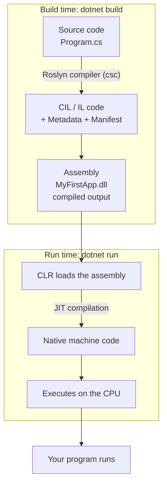

# Week 1 — C# Introduction and Setup

**Module:** CS6004NP Application Development
**Target:** C# 14 on .NET 10

> **Toolchain:** Visual Studio Code with the C# Dev Kit. See [CSharp-DotNet-Setup.md](CSharp-DotNet-Setup.md) for installation. Note that C# Dev Kit requires a Visual Studio subscription for sign-in; the CLI workflow in section 7 works without it.

---

## 1. C# vs .NET

- **C#** is a programming language. It has syntax, keywords, and type rules.
- **.NET** is a platform. It has a runtime, an SDK, and libraries.

A useful way to separate them: **C# is the recipe, .NET is the kitchen** that turns the recipe into an actual meal.

| Term | Belongs to |
| --- | --- |
| syntax, keywords, type rules | C# language |
| runtime, SDK, libraries | .NET platform |

---

## 2. What is C#

C# (pronounced "C-Sharp") is a high-performance, general-purpose programming language developed by Microsoft and maintained alongside the .NET ecosystem.

- The syntax is very similar to Java, so Java knowledge transfers well.
- It is compiled, type-safe, and case-sensitive (`Name` and `name` are different).
- It runs on .NET — C# by itself is not a runtime.

For a Java-to-C# syntax translation table, see [CSharp-Java-Syntax-Cheatsheet.md](CSharp-Java-Syntax-Cheatsheet.md).

---

## 3. What is .NET

.NET (pronounced "Dot NET") is a free, open-source, cross-platform ecosystem, not just a framework. It runs on Windows, Linux, and macOS, and supports mobile, cloud, and IoT targets.

- Supports multiple languages: **C#, F#, VB.NET**
- One consistent API across all platforms
- Package ecosystem through **NuGet**
- C# is the primary language of the platform

---

## 4. Key C# features

| Feature | Meaning |
| --- | --- |
| Simple and modern | Clean, easy-to-learn syntax |
| Type-safe | Strong compile-time and runtime checking |
| Object-oriented | Classes, inheritance, polymorphism, encapsulation |
| Cross-platform | Runs on Windows, Linux, and macOS via .NET |
| Automatic memory management | Garbage collection handles cleanup |
| Generics | Type-safe, reusable code |
| LINQ | SQL-like queries over collections and data |
| Async programming | `async`/`await` for concurrent work |
| Rich standard library | The .NET Base Class Library (BCL) |

---

## 5. Why .NET stands out

- **Universal and open source** — Windows, Linux, macOS, mobile, cloud, and IoT on a free, open-source platform.
- **Build anything** — web apps, mobile apps with MAUI, games with Unity, desktop apps with WinForms/WPF, and cloud services.
- **Familiar** — C-family syntax using `;`, `{}`, `if`/`else`, `for`/`while`, and `foreach`.
- **Safe and fast** — near-native performance without writing unsafe code for most applications.
- **Multi-paradigm** — object-oriented core plus lambdas, LINQ, and modern `async` patterns.
- **Industry-backed and growing** — powers the majority of enterprise .NET workloads, with annual updates.
- **Career value** — widely used for enterprise applications, with strong demand and salary prospects.

---

## 6. How .NET runs your code

C# is never executed directly. Compilation happens in two stages — one at build time, one at run time — and that split is what makes .NET cross-platform.

### 6.1 The full pipeline



### 6.2 The stages

- **Source code (`.cs`)** — plain text files containing C#.
- **Compilation (Roslyn `csc`)** — the SDK's compiler parses, binds, and emits CIL. It cannot emit native code, because it does not know the target CPU.
- **CIL + metadata + manifest** — the compiler output: the instructions, a description of every type and member, and assembly-level details such as version and target framework.
- **Assembly (`.dll`)** — those parts packaged into one file. This is the compiled output; the `.exe` is only a small launcher that starts the runtime.
- **CLR loads the assembly** — checks the runtime version, reads the metadata, verifies the CIL, and manages memory, type safety, and the BCL.
- **JIT compilation** — each method is translated to native code the first time it is called, so startup stays fast and the code is optimised for the actual CPU.
- **Execution** — native code runs on the CPU, with the garbage collector working throughout.

### 6.3 Key components

| Component | Role |
| --- | --- |
| **CIL / IL** | Platform-neutral intermediate code that C# compiles into |
| **CLR** | Common Language Runtime: manages execution, memory, and type safety |
| **JIT** | Just-In-Time compiler: converts CIL to native code at run time |
| **BCL** | Base Class Library: pre-built types such as `Console` and `String` |

### 6.4 `.dll` vs `.exe`

- **`.dll`** = **Dynamic Link Library**
- **`.exe`** = **Executable**

**The `.dll` is your code. The `.exe` only starts it.**

| File | Job |
| --- | --- |
| `MyFirstApp.dll` | Your actual compiled C# code |
| `MyFirstApp` or `MyFirstApp.exe` | A launcher that starts the .NET runtime, then hands off to the `.dll` |

What happens when you run the app:

1. You run `MyFirstApp.exe` (on macOS and Linux it has no extension: `./MyFirstApp`)
2. The `.exe` starts the .NET runtime
3. The runtime reads `MyFirstApp.dll` and executes your program

The launcher holds none of your logic, which is why it is usually larger than the `.dll` beside it.

**Proof that the `.dll` is the real program** — from the build output folder, run the `.dll` directly with no launcher at all:

```bash
cd bin/Debug/net10.0
dotnet MyFirstApp.dll
```

Both print `Hello World !`.

**Why the naming confuses people:** traditionally `.exe` meant a program you run and `.dll` meant a library for other programs. Modern .NET produces a `.dll` even for applications, so `.exe` now only means "start here."

**Analogy:** the `.dll` is the recipe, the `.exe` is the waiter bringing it to the kitchen (the runtime), and the CPU eats the finished meal.

### 6.5 Why it matters

- **Cross-platform** — the same `.dll` runs on Windows, macOS, and Linux. Only the JIT step is platform-specific, so you build once and run anywhere.
- **Familiar** — Java works the same way: `javac` → bytecode → JVM → JIT.
- **Efficient** — only the code your program actually executes gets compiled.

---

## 7. Running C# code from the CLI

### 7.1 Create the project

```bash
dotnet new console -n MyFirstApp
```

### 7.2 Enter the project folder

```bash
cd MyFirstApp
```

### 7.3 Check the project files

```bash
ls        # macOS / Linux
dir       # Windows
```

You should see `Program.cs`, a `MyFirstApp.csproj` project file, and an `obj` folder created during restore. A `bin` folder appears after the first build.

### 7.4 Write the program

Open `Program.cs` and replace its contents:

```csharp
Console.WriteLine("Hello World !");
```

### 7.5 Build the project

```bash
dotnet build
```

### 7.6 Run the application

```bash
dotnet run
```

Expected output:

```text
Hello World !
```

Other useful commands:

| Command | Purpose |
| --- | --- |
| `dotnet new console -n <name>` | Create a new console project |
| `dotnet build` | Compile the project |
| `dotnet run` | Build and run the project |
| `dotnet --version` | Check the installed SDK version |

---

## 8. Using VS Code

1. Open the project folder with `code .` or **File > Open Folder**.
2. Open `Program.cs` and edit the code.
3. Press `Ctrl` + `F5` to run without debugging, or `F5` to run with the debugger.
4. Use the integrated terminal to run `dotnet build` and `dotnet run` directly.

On macOS, `F5` and `Ctrl` + `F5` are media keys on many keyboards, so you may need to hold `fn` as well. For the full Command Palette walkthrough, see [CSharp-DotNet-Setup.md](CSharp-DotNet-Setup.md).

---

## 9. Summary

- C# is the **language**; .NET is the **platform**. Keep them separate in your head.
- .NET compiles C# to CIL, and the CLR uses the JIT to produce native code at runtime.
- The .NET 10 SDK plus VS Code with the C# Dev Kit is the toolset for this course.
- The core workflow is `dotnet new` → edit → `dotnet build` → `dotnet run`.

## References

- [C# and .NET setup guide](CSharp-DotNet-Setup.md)
- [Java-to-C# syntax cheatsheet](CSharp-Java-Syntax-Cheatsheet.md)
- [C# documentation](https://learn.microsoft.com/en-us/dotnet/csharp/)
- [Tips for C# Java developers](https://learn.microsoft.com/en-us/dotnet/csharp/tour-of-csharp/tips-for-java-developers)
- [What is .NET?](https://learn.microsoft.com/en-us/dotnet/fundamentals/)
- [Download the .NET SDK](https://dotnet.microsoft.com/en-us/download/dotnet)
